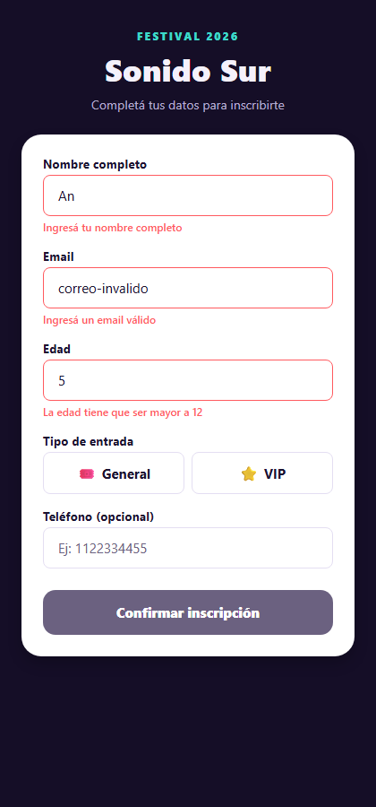
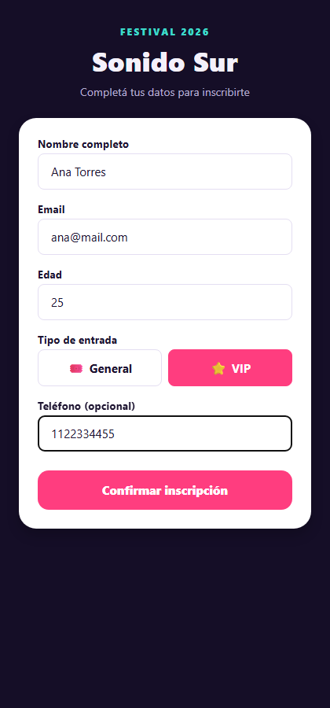
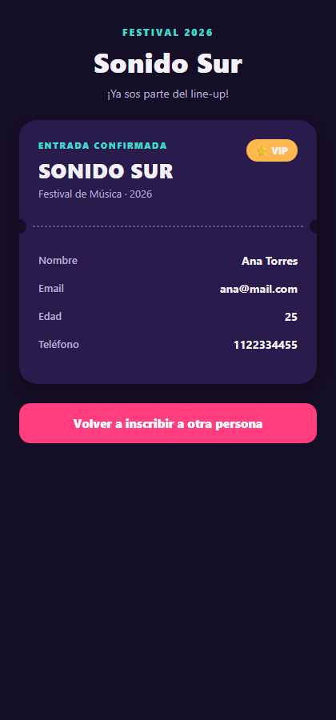

# Sonido Sur — Inscripción al festival

TP de formularios con validaciones y estados complejos, hecho con React Native + Expo + React Hook Form.

## Cómo correr el proyecto

```bash
npm install
npx expo start
```

Desde ahí se puede abrir con:
- `a` → Android (emulador o dispositivo con Expo Go)
- `i` → iOS (requiere macOS)
- `w` → Web (navegador)

## Forma de validación elegida

Se usó **React Hook Form** (`useForm` + `Controller` + `rules`), la opción recomendada en la consigna. Se eligió por sobre la validación manual porque evita tener que mantener a mano un objeto de errores en paralelo al de los datos: React Hook Form ya expone `errors`, `isTouched` e `isValid` por campo, con menos código y menos lugares donde introducir bugs (como olvidarse de limpiar un error viejo).

Detalles de UX pensados a propósito:
- Los mensajes de error solo se muestran una vez que el usuario "tocó" el campo (`isTouched`), así el formulario no arranca lleno de rojo apenas se abre la pantalla.
- El modo de validación es `onChange`, así el error desaparece apenas el dato se corrige, sin esperar a un nuevo submit.
- El botón "Confirmar inscripción" usa `formState.isValid`, calculado con `trigger()` al montar la pantalla, así queda deshabilitado desde el principio (sin necesidad de que el usuario interactúe primero).

## Estructura

```
App.js
src/
  screens/
    InscripcionScreen.js   → estado real (lifting state up), decide formulario vs ticket
  components/
    CampoFormulario.js     → input de texto reutilizable (label + error)
    SelectorEntrada.js     → toggle General / VIP
    TicketConfirmacion.js  → ticket de confirmación, recibe los datos por props
  theme/
    colors.js              → paleta y espaciados compartidos
```

## Bonus resueltos

- **AsyncStorage**: al confirmar una inscripción se guarda el email en `AsyncStorage`. La próxima vez que se abre la app, ese email se precarga solo en el campo correspondiente.
- **Loading simulado**: al tocar "Confirmar inscripción" el botón muestra un spinner y espera ~1 segundo (simulando el envío a un servidor) antes de mostrar el ticket.

## Capturas

| Formulario con errores | Formulario válido | Ticket de confirmación |
|---|---|---|
|  |  |  |
